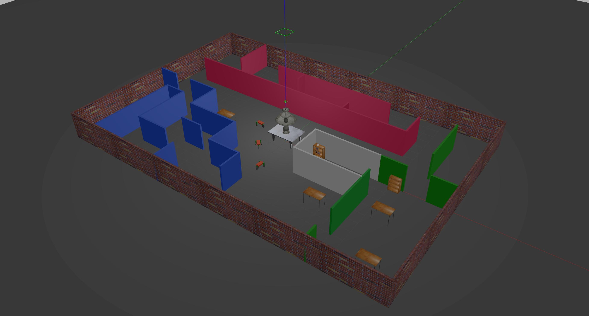

# Simulation World Gazebo
Sample simulation world for the Udacity "Robotics Software Engineer" Nanodegree.

Includes:

- A building model created with the Gazebo Building Editor tool.
- Three instances of models of robots with three wheels created with the Gazebo Model Editor tool.
- A number of models imported from the Gazebo model database: table, table_marble, fountain, bookshelf, beer, coke_can, bowl.
- A C++ plugin printing the message "Welcome to Gabriele's World!\n" when opening the world with Gazebo.

